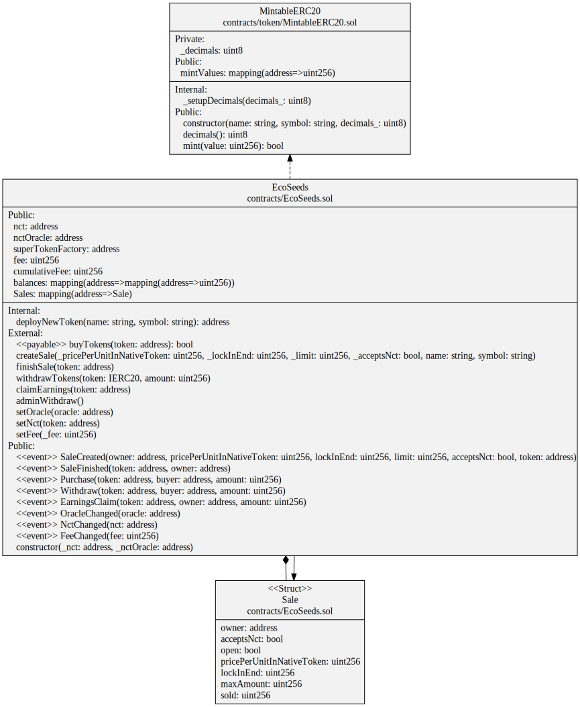

## Token flow 
1. Deploy token contract
2. Approve unlimited minting to the sales contract
3. Create sale
    a. Mint tokens to the sales contract
    b. Sale configuration
4. Buy tokens
    a. Increase user balance at the sales contract
    b. Setup superfluid token earnings stream
5. Withdraw tokens
    a. Check if lock period is over
    b. Decrease user balance at the sales contract according to the earnings stream
    c. Send tokens to user

## How to generate the class diagram
```bash
yarn add sol2uml
yarn sol2uml class contracts
```

## Tasks 
- [x] Create a repo	
- [x] Create a README.md
- [x] Create a .gitignore
- [x] Create a LICENSE
- [ ]  Fix the overview diagram